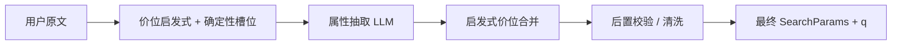

# huili-Intent-rec

面向「找货 / 商品检索」场景的 **意图与结构化检索参数** 管线：在 LLM 前后用 **确定性规则** 约束价位、圈口、热度等字段，减少口语、行话与模型幻觉带来的脏数据。

## 能力概览

| 阶段 | 作用 | 主要代码 |
|------|------|------------|
| **前置启发式** | 从用户原文解析价位行话、口语预算、数字区间；可替换行话为数字区间供 LLM 对齐；与确定性槽位互补 | `src/priceHeuristic.ts`、`src/priceSlangLexicon.ts`、`src/priceKaiOpen.ts`、`src/preprocessPriceTerms.ts`、`src/deterministicSlots.ts` |
| **LLM** | 意图分类（可关）、属性抽取为 `SearchParams`（Zod 结构化输出） | `src/classify.ts`、`src/extract.ts`、`src/searchSchema.ts` |
| **后置规则引擎** | 按原文强制校验：无句面依据时清空臆测价/热度/圈口；价与 heat/圈口交叉去污染；检索词 `q` 去行话 | `src/sanitizeSearchParams.ts`、`src/priceHeuristic.ts`（`messageSuggestsUserStatedBudget`、`finalizeSearchParamsQ` 等） |

整体数据流（属性抽取链路）可概括为：



## 技术栈

- **运行时**： [Bun](https://bun.sh)
- **HTTP**： [Hono](https://hono.dev)
- **LLM**： LangChain + OpenAI 兼容接口（默认阿里云 DashScope / 通义千问）
- **契约**： [Zod](https://zod.dev)（`SearchParamsSchema`）

## 快速开始

### 环境要求

- [Bun](https://bun.sh) 已安装

### 配置

```bash
cp .env.example .env
# 编辑 .env：至少配置 DASHSCOPE_API_KEY（或 OPENAI_API_KEY）
```

常用变量说明见 [.env.example](.env.example)。

### 安装与运行

```bash
bun install
bun run start
```

默认提供 HTTP 服务，端口由环境变量 **`PORT`** 指定，缺省为 **3000**（见 `src/index.ts`）。例如：

- `GET /health` — 健康检查  
- `GET /` — 若存在 `public/index.html` 则返回静态页  
- `POST /intent` — 意图 + 属性抽取（请求体见 `RequestSchema`）

开发热重载：

```bash
bun run dev
```

## 脚本

| 命令 | 说明 |
|------|------|
| `bun run start` | 启动 API |
| `bun run dev` | 监听文件变更重启 |
| `bun run build:dify` | 将 `src/difyPriceHeuristic.ts` 打成单文件 `dist/difyPriceHeuristic.js`，便于粘贴到 **Dify 代码节点**（浏览器 / ESM、无 Node 内置依赖） |

## 目录结构（核心）

```
src/
  classify.ts           # 意图分类（可由 INTENT_CLASSIFICATION_ENABLED 关闭）
  extract.ts            # 属性抽取编排：启发式 → LLM → 合并 → 后置校验 → finalize q
  priceHeuristic.ts     # 价位启发式、句面预算检测、q 行话剥离、给 LLM 的价位提示
  priceSlangLexicon.ts  # 行话/口语价位词表（与前置替换共用）
  priceKaiOpen.ts       # 「小六一开」类 X 开档位解析
  preprocessPriceTerms.ts # 用户原文行话 → 数字区间替换（最长匹配）
  deterministicSlots.ts # 数字价位/圈口等正则槽位（与启发式互补）
  sanitizeSearchParams.ts # 后置规则引擎：对齐原文、清字段、防价与其它数字串台
  difyPriceHeuristic.ts # Dify 专用入口：仅输出处理后的 query 串
  searchSchema.ts       # SearchParams Zod Schema
  index.ts              # Hono 路由与 /intent 组装
dist/
  difyPriceHeuristic.js # build:dify 产物
prompts/                # 抽取 / 分类等提示片段
```

## 与 Dify 代码节点

`bun run build:dify` 生成的 `dist/difyPriceHeuristic.js` 可粘贴到 **Dify 代码节点**，对用户输入做 **价位前置规范化**（与仓库内 `preprocessPriceTerms`、`extractHeuristicPriceFromSegments` 同源思路）。修改源码后请重新构建再同步到线上。

## 设计原则（简述）

1. **前置**：能由词典 + 正则 + 中文数字解析确定的价位，优先写入启发式结果，并与 LLM 输出 **合并**（见 `mergeHeuristicPriceIntoSearchParams`）。  
2. **后置**：无用户句面支撑时，不允许保留模型填的 `price_*`、`heat_*`、`inner_circle_*` 等（见 `sanitizeSearchParamsAgainstUserText`）。  
3. **检索串 `q`**：剥离价位行话，避免向量检索被「小六」「中五」等污染（见 `finalizeSearchParamsQ` / `stripPriceSlangFromSearchQ`）。

## License

若未单独提供许可证文件，默认 **All Rights Reserved**；开源前请在本仓库补充 `LICENSE` 并更新本节说明。
