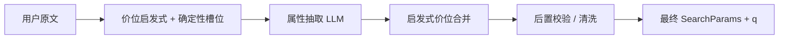

# huili-Intent-rec

面向「找货 / 商品检索」场景的 **意图与结构化检索参数** 管线：在 LLM 前后用 **确定性规则** 约束价位、圈口、热度等字段，减少口语、行话与模型幻觉带来的脏数据。

## 能力概览

| 阶段 | 作用 | 主要代码 |
|------|------|------------|
| **前置启发式** | 从用户原文解析价位行话、口语预算、数字区间；可替换行话为数字区间供 LLM 对齐；与确定性槽位互补 | `src/priceHeuristic.ts`、`src/priceSlangLexicon.ts`、`src/priceKaiOpen.ts`、`src/preprocessPriceTerms.ts`、`src/deterministicSlots.ts` |
| **LLM** | 意图分类（可关）、属性抽取为 `SearchParams`（Zod 结构化输出） | `src/classify.ts`、`src/extract.ts`、`src/searchSchema.ts` |
| **后置规则引擎** | 按原文强制校验：无句面依据时清空臆测价/热度/圈口；价与 heat/圈口交叉去污染；检索词 `q` 去行话，并对高频短词做确定性扩写 | `src/sanitizeSearchParams.ts`、`src/searchQueryNormalizer.ts`、`src/priceHeuristic.ts`（`messageSuggestsUserStatedBudget`、`finalizeSearchParamsQ` 等） |

整体数据流（属性抽取链路）可概括为：



## 技术栈

- **运行时**： [Bun](https://bun.sh)
- **HTTP**： [Hono](https://hono.dev)
- **LLM**： LangChain + OpenAI 兼容接口（默认阿里云 DashScope / 通义千问）
- **契约**： [Zod](https://zod.dev)（`SearchParamsSchema`）

## 快速开始

### 环境要求

- [Bun](https://bun.sh) 已安装

### 配置

```bash
cp .env.example .env
# 编辑 .env：至少配置 DASHSCOPE_API_KEY（或 OPENAI_API_KEY）
```

常用变量说明见 [.env.example](.env.example)。

### 安装与运行

```bash
bun install
bun run start
```

默认提供 HTTP 服务，端口由环境变量 **`PORT`** 指定，缺省为 **3000**（见 `src/index.ts`）。例如：

- `GET /health` — 健康检查  
- `GET /` — 若存在 `public/index.html` 则返回静态页  
- `POST /intent` — 意图 + 属性抽取（请求体见 `RequestSchema`）

开发热重载：

```bash
bun run dev
```

## 脚本

| 命令 | 说明 |
|------|------|
| `bun run start` | 启动 API |
| `bun run dev` | 监听文件变更重启 |
| `bun run build:dify` | 一次性打包两个 Dify 脚本：前置启发式 `dist/difyPriceHeuristic.js` 与后置规则引擎 `dist/difyPostRuleEngine.js` |
| `bun run build:dify:pre` | 单独打包 `src/difyPriceHeuristic.ts` 到 `dist/difyPriceHeuristic.js` |
| `bun run build:dify:post` | 将 `src/difyPostRuleEngine.ts` 打成单文件 `dist/difyPostRuleEngine.js`，用于 **Dify 代码节点**中的后置规则清洗 |

## 目录结构（核心）

```
src/
  classify.ts           # 意图分类（可由 INTENT_CLASSIFICATION_ENABLED 关闭）
  extract.ts            # 属性抽取编排：启发式 → LLM → 合并 → 后置校验 → finalize q
  priceHeuristic.ts     # 价位启发式、句面预算检测、q 行话剥离、给 LLM 的价位提示
  priceSlangLexicon.ts  # 行话/口语价位词表（与前置替换共用）
  priceKaiOpen.ts       # 「小六一开」类 X 开档位解析
  preprocessPriceTerms.ts # 用户原文行话 → 数字区间替换（最长匹配）
  deterministicSlots.ts # 数字价位/圈口等正则槽位（与启发式互补）
  searchQueryNormalizer.ts # 高频短词 q 扩写、圈口 min/max 提取
  sanitizeSearchParams.ts # 后置规则引擎：对齐原文、清字段、防价与其它数字串台
  difyPriceHeuristic.ts # Dify 专用入口：仅输出处理后的 query 串
  difyPostRuleEngine.ts # Dify 专用后置规则引擎：清洗 LLM 抽取结果并输出 search_params
  searchSchema.ts       # SearchParams Zod Schema
  index.ts              # Hono 路由与 /intent 组装
dist/
  difyPriceHeuristic.js # build:dify 产物
  difyPostRuleEngine.js # build:dify:post 产物
prompts/                # 抽取 / 分类等提示片段；`query_extraction.txt` 只生成 q，`filter_attribute_extraction.txt` 只生成筛选字段
```

## 与 Dify 代码节点

`bun run build:dify` 会同时生成：

- `dist/difyPriceHeuristic.js`：前置启发式，对用户输入做 **价位前置规范化**
- `dist/difyPostRuleEngine.js`：后置规则引擎，对属性抽取结果做 **后置清洗**

`bun run build:dify:post` 生成的 `dist/difyPostRuleEngine.js` 可粘贴到 **Dify 代码节点**，对 LLM 已抽取出的结构化字段做 **后置规则清洗**：优先复用 `after_list` 中的前置启发式文本来纠正 `price_*`，再结合 `query` / `query_list` 判断当前轮是否在补充上一轮条件；无句面证据时清空误填的 `price_*` / `heat_*`；同时对 `挂件`、`黑色`、`18k`、裸两位圈口等高频短词做确定性 `q` 扩写，并提取 `inner_circle_size_min/max`，仅对手镯/戒指等环形商品生效。若你要替换 `属性赋值` 节点，建议输入为：

- `query`：当前轮用户原话
- `after_list`：前置启发式后的多轮数组
- `query_list`：原始多轮数组
- `new_attributes_other`：LLM 抽取出的属性对象或 JSON 字符串

返回值仅保留：

- `merged_attributes`：清洗后的属性对象

说明：

- 该节点会优先把 `query` 视为当前轮硬证据。
- 当当前轮像“补充条件”而不是“改口重开”时，会参考 `query_list` 中上一轮原话，避免误清空历史预算/热度。
- 由于 `after_list` 仍是文本而不是结构化 heuristic，后置节点会在其基础上再做一次轻量解析，用于恢复 `price_*`。
- 价位启发式会覆盖真实口语里的 `千元内` / `万元内`、`6000元左右` 等预算表达；`9k`、`18k` 等常见 K 金纯度不会被当成价格。
- 后置规则会把 `56-58圈口`、`圈口63到65` 输出为 `inner_circle_size_min/max` 范围；裸 `57` 或 `56圈口` 这类单点圈口只填 `inner_circle_size_min`，不填 max。
- 类目后置规则按同一句中每个类目的最后一次有效表态处理；`不要翡翠` 只进 `negative_filters`，不会反向猜其它 `category_id`。规则词表只收录从线上 `query-stats.json` 与 `query-categorys.json` 里验证过的稳定材质/大类词，例如 `危料`/`乌鸡` 归翡翠、`籽料`/`青花`/`藕粉` 归玉石、`珍珠`/`水晶`/`蜜蜡`/`南红` 归彩宝；`手镯`、`挂件`、`平安扣` 等跨类目形态词不直接定类目。
- 线上高频服务词也会做确定性兜底：`免保证金`/`免保` 设置 `is_free_guarantee=true`，`折扣`/`优惠` 设置 `has_discount=true`，`即将结拍`/`快结束` 设置 `is_early_close=true`。裸 `能出价` 不再作为热度证据，避免把免保证金请求误写入 `heat_*`。

修改源码后请重新构建再同步到线上。

## Prompt 拆分

为降低单个属性抽取 prompt 的长度，并避免“q 允许补全”和“筛选字段必须保守”两套目标互相污染，已提供两份拆分后的提示词：

- `prompts/query_extraction.txt`：只输出 `{"q":"..."}`，负责生成适合向量检索的标题化短描述。
- `prompts/filter_attribute_extraction.txt`：不输出 `q`，只输出 `price_*`、`heat_*`、`inner_circle_*`、类目、布尔标记、否定过滤等筛选字段。

现有 `prompts/attribute_extraction.txt` 仍保留为兼容旧链路的单模型版本。

## 设计原则（简述）

1. **前置**：能由词典 + 正则 + 中文数字解析确定的价位，优先写入启发式结果，并与 LLM 输出 **合并**（见 `mergeHeuristicPriceIntoSearchParams`）。  
2. **后置**：无用户句面支撑时，不允许保留模型填的 `price_*`、`heat_*`、`inner_circle_*` 等（见 `sanitizeSearchParamsAgainstUserText`）。  
3. **检索串 `q`**：剥离价位行话，避免向量检索被「小六」「中五」等污染；对 `挂件`、`黑色`、`18k` 等真实高频短词做确定性扩写（见 `finalizeSearchParamsQ` / `normalizeSearchParamsForSearch`）。

## License

若未单独提供许可证文件，默认 **All Rights Reserved**；开源前请在本仓库补充 `LICENSE` 并更新本节说明。
